# Git branch 模型決策：main＋環境快照 branch

> **採用模型**：`main` 是唯一可修改的版本來源；`sit`、`qa`、`uat`、`prod` 是四條唯讀部署快照 branch。所有部署都從相應快照 branch 的目前 tip 執行。多環境 branch 合併鏈、feature branch 直接部署與回同步均不採用。

## 1. 模型與責任

| branch | 用途 | 可寫入者 | 部署用途 |
| --- | --- | --- | --- |
| `main` | 唯一內容真相來源 | feature branch 經 PR merge | 不直接部署 |
| `sit` | SIT 完整 File Repository 快照 | 受信任 dispatcher，只能 fast-forward | SIT |
| `qa` | QA 完整 File Repository 快照 | 受信任 dispatcher，只能 fast-forward | QA |
| `uat` | UAT 完整 File Repository 快照 | 受信任 dispatcher，只能 fast-forward | UAT |
| `prod` | PROD 完整 File Repository 快照 | 受信任 dispatcher，只能 fast-forward | PROD |

開發者不得直接 push、merge、cherry-pick、rebase、force-push 或刪除快照 branch。快照只可快進至其現有 tip 的後代，且目標 commit 必須是 `main` 的祖先。

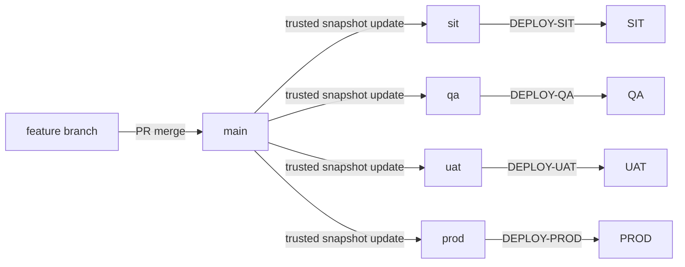

## 2. 快照與部署規則

1. PR merge 只更新 `main`；快照 fast-forward 只建立待部署狀態；兩者都不觸發部署。
2. deploy tag 的環境欄位只能是 `SIT`、`QA`、`UAT`、`PROD`，並映射到同名小寫快照 branch。
3. dispatcher 必須驗證 tag commit **等於**該快照 branch 的目前 tip，且是 `main` 祖先；過期快照、錯誤環境或任何非快進的 branch 更新一律拒絕。
4. 部署差異固定為 `current-success/<environment> commit..snapshot tip`。四個環境都做後代校驗，禁止舊快照覆蓋較新的成功部署。
5. 快照 branch 只表示可部署的 Git 狀態；實際環境狀態以各環境 deployment record 的 `current-success` 為準。部署失敗不更新 `current-success`。

此模型可以讓 SIT、QA、UAT、PROD 停在不同的 `main` commit，卻保證每個部署都是完整且可追溯的 `main` 快照。

實際 commit 拓樸（四條快照 branch 各自停在不同的 `main` commit，圖中 `merge` 僅為示意快照 ref 前進到該 commit，實際操作是 fast-forward、不產生額外 merge commit）：

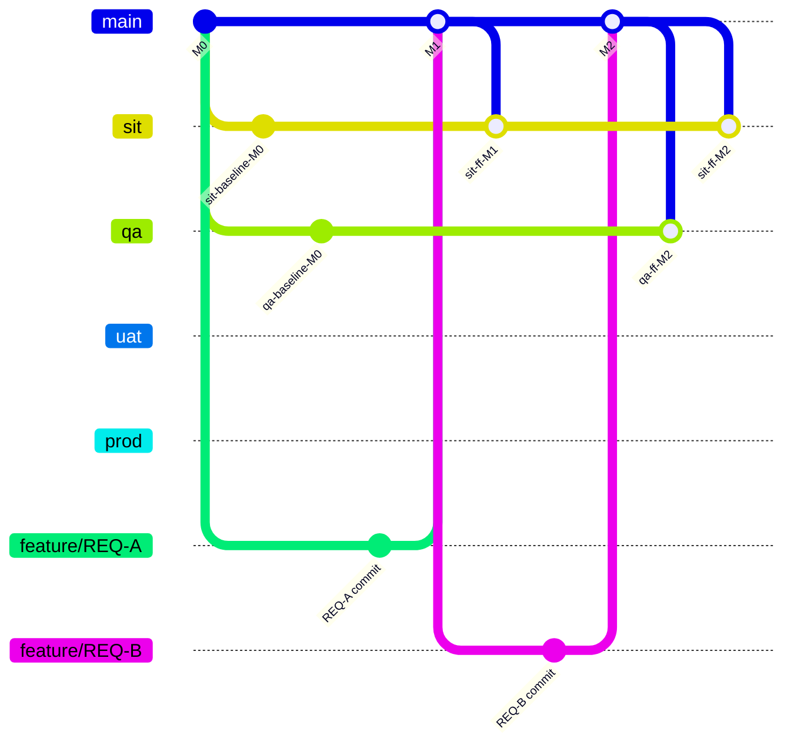

`uat`、`prod` 尚未推進，仍停在 `M0`；`sit` 已推進兩次（`M1`、`M2`），`qa` 只推進一次（直接到 `M2`）。四條快照 branch 彼此推進時機完全獨立，取決於各環境的部署排程與核准進度。

## 3. Kettle File Repository：同一檔案的多需求變更

Kettle XML 以 File Repository 路徑為部署單位；同一路徑的 XML 不可依需求單號拆分。

### 案例：REQ-A 與 REQ-B 修改相同 XML

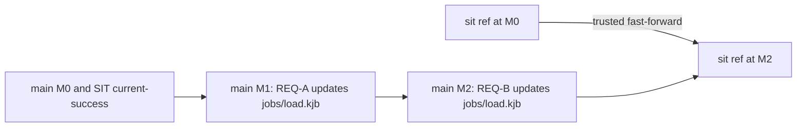

`sit` 推進至含 REQ-B 的 `M2` 時，部署 `M0..M2`：

- `jobs/load.kjb` 只會取用 `M2` 的完整 XML blob 並匯入一次。
- 不得依 REQ-A／REQ-B 的 tag、PR 檔案清單或 cherry-pick，嘗試將 `M1` 的舊 XML 與 `M2` 的新 XML 分開部署。
- 因此，兩張需求已修改同一檔且併入 `main` 後，無法選擇性只部署其中一張。需在合併前完成獨立驗證，或以 `main` merge 與快照推進順序控制釋出。
- 這避免先前版本覆蓋後續版本，並符合 File Repository 的實際匯入語意。

實際 commit 拓樸：

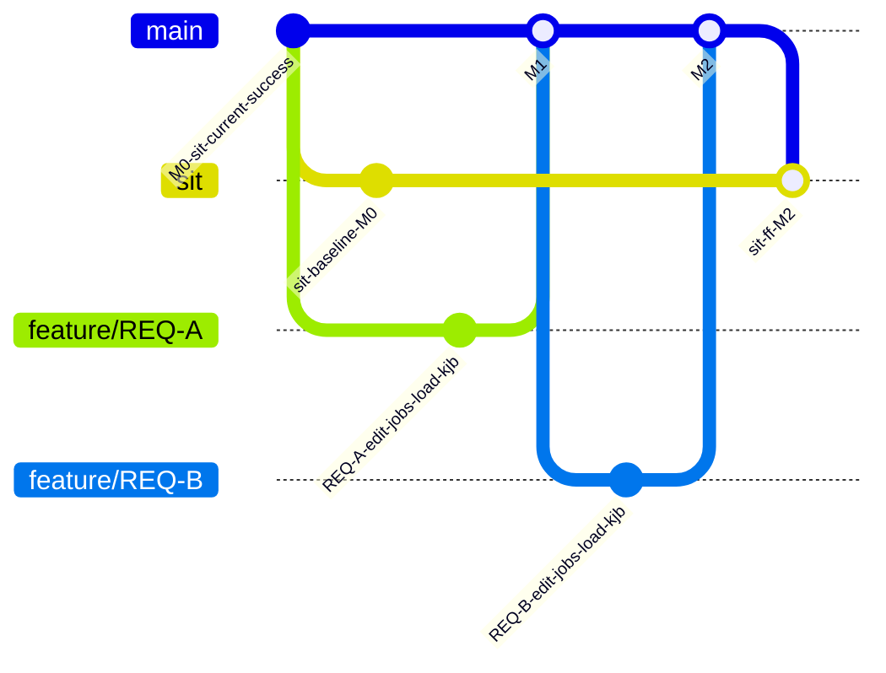

`sit` 從 `M0` 一次 fast-forward 到 `M2`（示意圖以 `merge` 表示，實際不產生額外 merge commit），部署差異 `M0..M2` 只帶出 `jobs/load.kjb` 在 `M2` 的最終內容，`M1` 的中間版本不會單獨出現在部署裡。

## 4. 多環境紀錄與保留

SIT、QA、UAT、PROD 必須各自保存每次快照推進、部署請求、成功、失敗與最後成功部署狀態；不得因所有內容都來自 `main` 而只保留 PROD。

每筆 deployment record 至少包含：

- 目標環境、快照 branch 與 snapshot commit；
- 前次成功 commit、baseline tag、deploy tag 及 workflow run；
- Environment 核准結果、差異 XML path 與 blob hash、artifact digest；
- 轉換、Kettle import、Repository 查核結果，以及成功／失敗原因。

紀錄至少保留一年，Git commit、PR、baseline tag 與回滾紀錄永久保留。紀錄不得包含環境參數、憑證或其他機密值。

## 5. 需求分支生命週期（切出 → 開發 → 併版 → 刪除）

| 項目 | 規則 |
| --- | --- |
| 命名 | `feature/REQ-<需求單號>` |
| 建立來源 | 一律從 `main` 目前 tip 切出，禁止從快照 branch（`sit`/`qa`/`uat`/`prod`）切出 |
| 保護規則 | 不受 ruleset 保護，可自由 push／rebase／force-push；開發者對自己需求分支有完全控制權 |
| 部署 | 需求分支本身不可部署，也不受理任何 deploy tag；必須先併入 `main` 再由快照 branch 推進 |
| 結束條件 | PR 通過 review 並 merge 進 `main` 後即刪除；同一需求單如需追加變更，另開新分支或 reopen 舊 PR 討論後仍走新分支 |
| 保留例外 | 若需求被撤回或延後（未 merge），分支可保留；只有已 merge 的分支才會被刪除 |

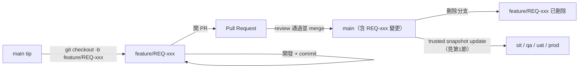

需求分支只是暫時工作區；一旦併入 `main`，該需求的「真相」即完全由 `main` 上的 commit 承載，分支本身刪不刪除不影響後續回退操作（回退依 commit，不依賴分支是否存在）。

實際 commit 拓樸（兩張需求單依序切出、開發、併版、刪除）：

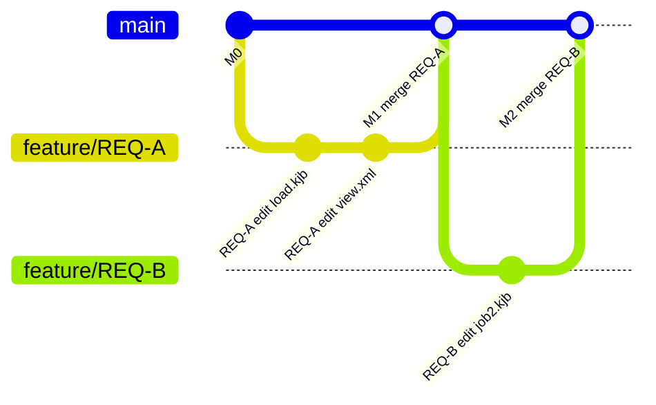

`feature/REQ-A`、`feature/REQ-B` 併入 `main` 後即刪除（GitHub 上為刪除分支 ref，不影響圖中已產生的 `M1`／`M2` commit）。

## 6. 回退已合併需求分支所變更的檔案

需求分支併入 `main` 且已刪除後，若需撤回該需求對某些檔案的變更，依「該檔案在此需求之後，是否又被其他已合併需求修改過」分兩種流程：

| 情境 | 判斷 | 流程 |
| --- | --- | --- |
| A：無後續衝突 | 目標檔案自 REQ-A merge 後未被任何後續已合併需求再次修改 | 直接 revert：`git revert <REQ-A 的 merge commit>`，或開 PR 將該檔案還原至 REQ-A 併入前版本 |
| B：有後續衝突 | 目標檔案在 REQ-A 之後，被一個或多個後續已合併需求（REQ-B、REQ-C…）再次修改 | 禁止直接 `git revert`（會整包退掉後續需求的變更或造成衝突）；須人工比對後，開新 PR 手動編輯檔案，只移除 REQ-A 的變更、保留後續需求的變更 |

兩種流程共同規則：

- 一律以「開新 PR、產生新 commit」方式完成，禁止改寫 `main` 歷史（no rebase／force-push）。
- 情境 B 必須先列出 REQ-A 之後所有觸碰同一檔案的需求清單，並與這些需求的負責人核對，確認回退後的檔案內容仍符合他們原本的需求；核對結果需記錄在 PR 描述中。
- 因 Kettle File Repository 以路徑為部署單位（見第 3 節），無論情境 A 或 B，回退 PR merge 後都是以「新 commit 的完整檔案內容」重新匯入一次，不會有「部分回退」的中間狀態。
- 回退 PR 併入 `main` 後，仍照第 1～2 節既有規則：不自動部署，需等快照 branch fast-forward 並 push 對應 deploy tag。

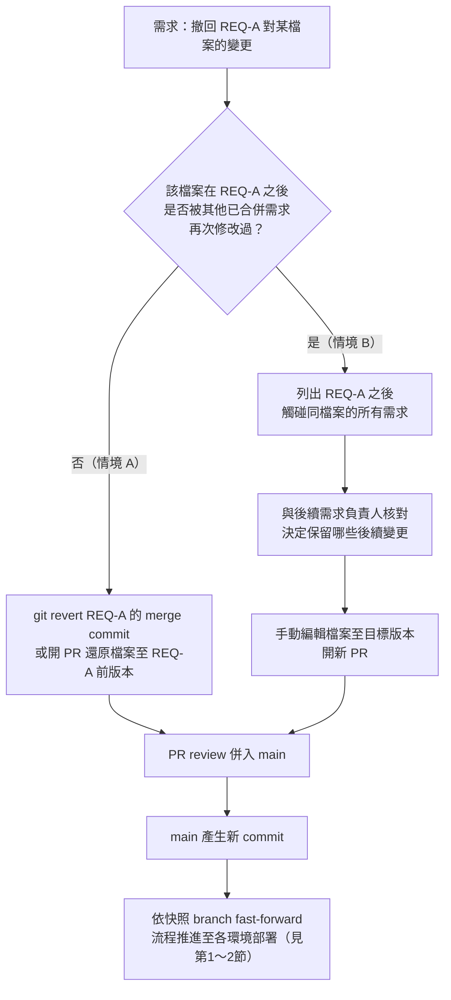

實際 commit 拓樸：

**情境 A（`load.kjb` 只有 REQ-A 動過，REQ-B 動別的檔案）**——直接 revert：

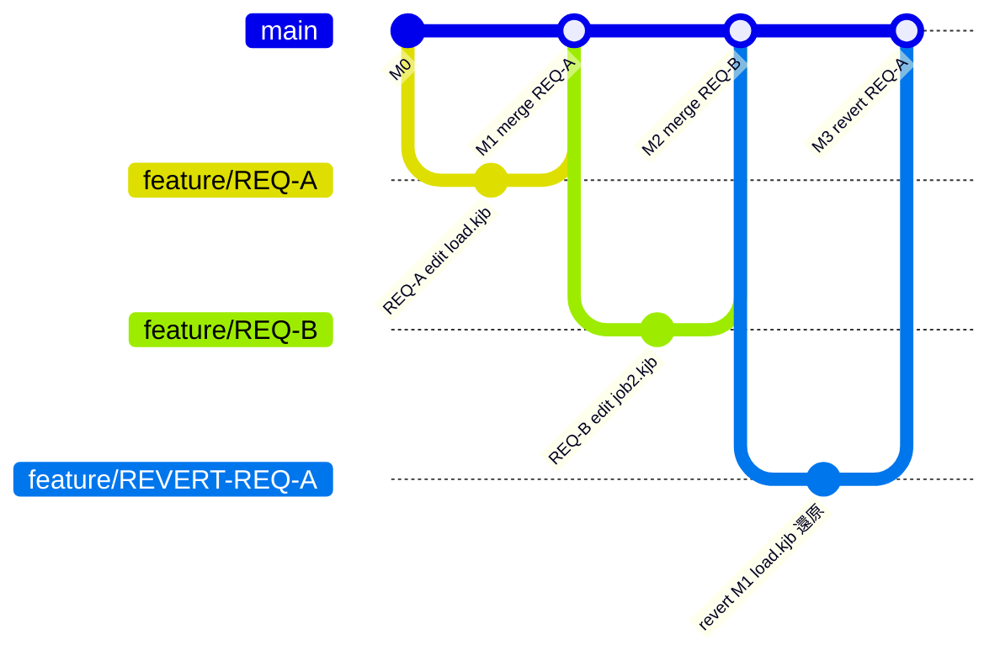

`M3` 是 `git revert M1` 或等效還原 PR 產生的新 commit，`load.kjb` 回到 REQ-A 之前版本，`job2.kjb`（REQ-B 的變更）不受影響。

**情境 B（`load.kjb` 被 REQ-A 與後續 REQ-B 都動過）**——禁止直接 revert，改人工比對後手動還原：

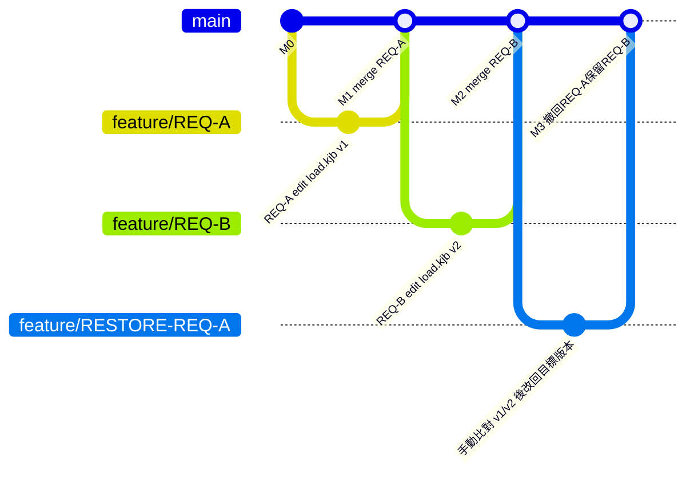

`M3` 不是單純 `git revert M1`（會連 REQ-B 對同檔案的改動一起打掉或造成 merge conflict），而是先確認 REQ-B 在 `load.kjb v2` 中的變更內容，手動編輯出「只保留 REQ-B、不含 REQ-A」的檔案版本後另開 PR 產生的新 commit。

### 6.1 情境判斷自動化

「檔案在 REQ-A 之後是否又被其他已合併需求動過」可用 `git log` 自動判斷，不必人工翻 commit 歷史：

```bash
# 單一檔案：REQ-A merge commit 之後，main 上是否還有其他 commit 動過這個檔案
git log --oneline <REQ-A-merge-commit>..main -- <file-path>
# 空結果 → 情境 A；有結果 → 情境 B，結果即是後續動過此檔的 commit 清單
```

批次判斷 REQ-A 一次改了多個檔案時：

```bash
# 1. 列出 REQ-A merge commit 本身改了哪些檔
git diff --name-only <REQ-A-merge-commit>^ <REQ-A-merge-commit> |
while read -r f; do
  hits=$(git log --oneline <REQ-A-merge-commit>..main -- "$f")
  if [ -z "$hits" ]; then
    echo "A(可直接revert): $f"
  else
    echo "B(需人工比對): $f"
    echo "$hits" | sed 's/^/    後續動過: /'
  fi
done
```

規則：

- 判斷結果只作為**分流依據**，不做自動 revert；情境 A、B 最終仍照上表走「開 PR、人工 review」流程，避免誤刪或誤蓋後續需求的變更。
- 建議包成 `workflow_dispatch` workflow：輸入 REQ-A 的 merge commit SHA，自動跑上述判斷並將結果（逐檔 A/B 分類、情境 B 的後續 commit 清單）輸出到 job summary，供人工決定回退方式。
- 情境 B 的後續 commit 清單可再用 `gh pr list --search <sha>` 或 commit message 中的 `REQ-` 編號反查對應需求單號，自動列出「這個檔案還被哪些需求單動過」，減少人工翻 log 的量。
- 此 workflow 屬於查詢／唯讀性質，不觸碰 `main` 或快照 branch，不需要 Environment 核准；仍須遵守跳板機 Runner 隔離原則（見 requirements.md），不得共用可存取 Environment secrets 的 workflow。

### 6.2 實測範例（本 repo 驗證紀錄）

以下三組案例已在本 repo 實際操作驗證第 6 節與 6.1 節規則，非假想範例；commit 皆為本 repo 真實歷史，可用 `git log --oneline --graph` 查看。

**案例 1（情境 A，無後續衝突）**

- `jobs/load.kjb`：REQ-A 修改（merge commit `68beb66` "M1 merge REQ-A"），REQ-B 只改 `jobs/job2.kjb`（merge commit `8890949` "M2 merge REQ-B"），未動 `load.kjb`。
- 判斷：`git log 68beb66..main -- jobs/load.kjb` 結果為空 → 情境 A。
- 執行 `git revert -m 1 68beb66`：無衝突，`load.kjb` 回到 REQ-A 之前版本，`job2.kjb`（REQ-B 的變更）不受影響。回退結果併入 `main` 為 `3ff3065` "M3 revert REQ-A"。

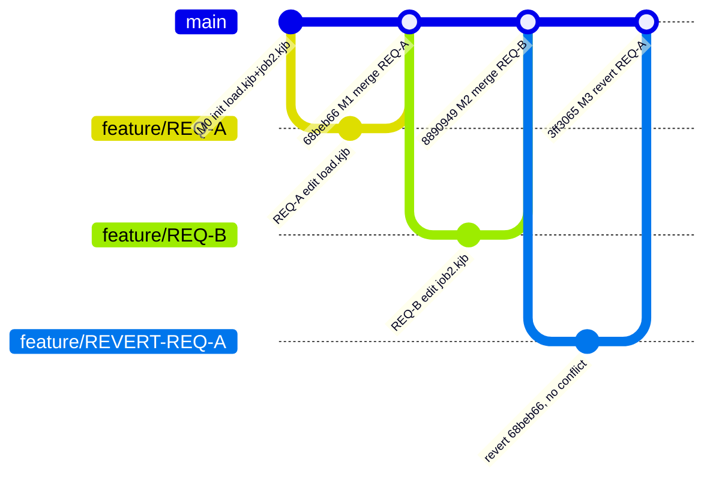

**案例 2（情境 B，有後續衝突）**

- `jobs/view.xml`：REQ-A2 加入內容（merge commit `a1a37a2` "M1b merge REQ-A2"），REQ-B2 在其基礎上再加內容（merge commit `988c2b2` "M2b merge REQ-B2"），兩需求改到同一檔案的重疊區塊。
- 判斷：`git log a1a37a2..main -- jobs/view.xml` 結果非空（顯示 REQ-B2 的 commit）→ 情境 B。
- 先實際嘗試 `git revert -m 1 a1a37a2` 驗證：產生真實 `CONFLICT (content)`，證實直接 revert 會打掉 REQ-B2 的變更，故 `git revert --abort` 中止。
- 改人工比對後手動編輯 `view.xml`（只保留 REQ-B2 內容、移除 REQ-A2 內容），另開分支產生新 commit 併入 `main`（`f94258c` "M3b 撤回REQ-A2保留REQ-B2"）。

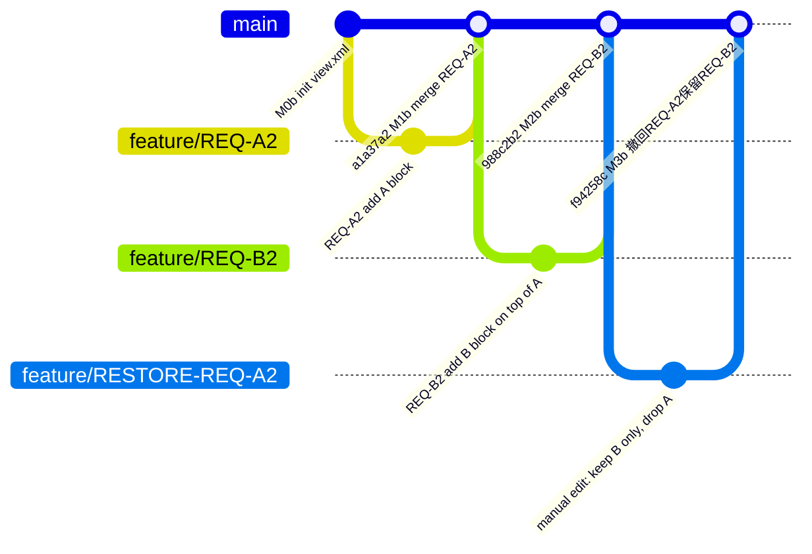

嘗試 `git revert -m 1 a1a37a2` 產生的 `CONFLICT` 因執行後隨即 `--abort`，未產生任何 commit，故不出現在上圖中；此步驟僅用來實證「情境 B 禁止直接 revert」的理由，實際回退路徑仍是 `RESTORE-REQ-A2` 這條分支。

**案例 3（10 檔混合，驗證 6.1 節自動化判斷）**

- `jobs2/f01.txt` ~ `f10.txt`：REQ-C 一次修改全部 10 檔（merge commit `6c86897` "Mc1 merge REQ-C"）；REQ-D 接著只疊加修改其中 `f01`~`f05`（merge commit `5b60623` "Mc2 merge REQ-D"），`f06`~`f10` 未再被動過。
- 對 REQ-C 的 merge commit 跑 6.1 節批次判斷腳本，一次驗證混合結果：`f01`~`f05` 判為情境 B（需人工比對）、`f06`~`f10` 判為情境 A（可直接 revert），與實際歷史相符。
- 對應 6.1 節「建議包成 `workflow_dispatch` workflow」的建議，已實作為 `.github/workflows/revert-impact-check.yml`：輸入 merge commit SHA，自動輸出每個檔案該走「開新 PR + `git revert`」或「開新 PR + 人工 review 手動編輯」，並附上不依賴 `gh` CLI、純 `git log` 的對照查詢指令供未安裝 `gh` 的人員使用。實際觸發此 workflow 對 `6c86897` 執行，輸出與上述判斷一致。

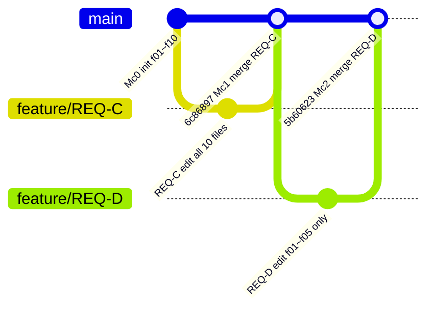

判斷 `6c86897` 時：`f01`~`f05` 因 `5b60623` 再次修改而落在情境 B（開新 PR + 人工 review），`f06`~`f10` 未被 `5b60623` 動到而落在情境 A（開新 PR + `git revert`），同一個 merge commit 底下不同檔案可以分屬不同流程。

## 7. 適用範圍說明

本節（第 5～6 節）與第 1～4 節同屬「main＋環境快照 branch」採用模型，為此模型的實作細節補充，不另立獨立文件。若未來需要更複雜的回退情境（例如同時撤回多個互相依賴的需求），應於本節擴充，而非另開文件，以維持單一事實來源。

## 8. 必要防線

- `main` 與四條快照 branch 都使用 ruleset 保護；快照 branch 的唯一 bypass 身分是受信任 dispatcher。
- deploy tag 必須是不可變 annotated tag；`DEPLOY-PROD-*` 的建立者僅限 `kettle-deployers`。
- 四個 GitHub Environment 都啟用 required reviewer、prevent self-review 與禁止 administrator bypass。
- 部署控制 workflow、腳本與第三方 action 釘選受保護 `main` 的固定 commit SHA；tag commit 只能提供受管理 XML payload，不能提供可執行部署程式。
- 失敗或回滾的內容只能經 PR 改回 `main`，再快進目標快照 branch；不得改寫快照 branch 或直接修改 Database Repository。
